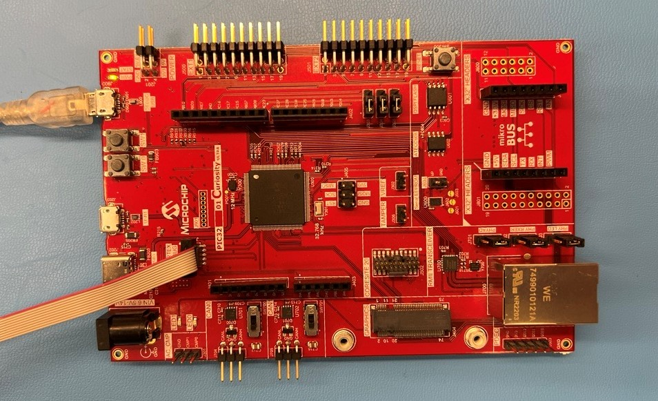
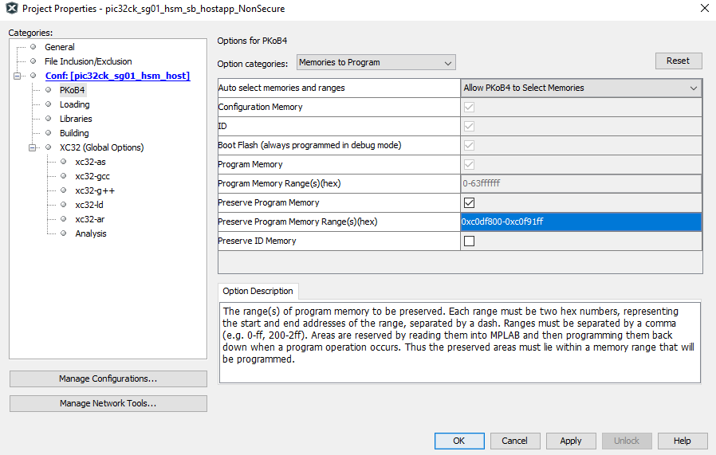
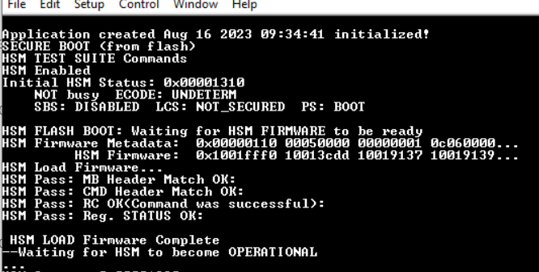
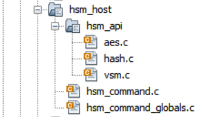
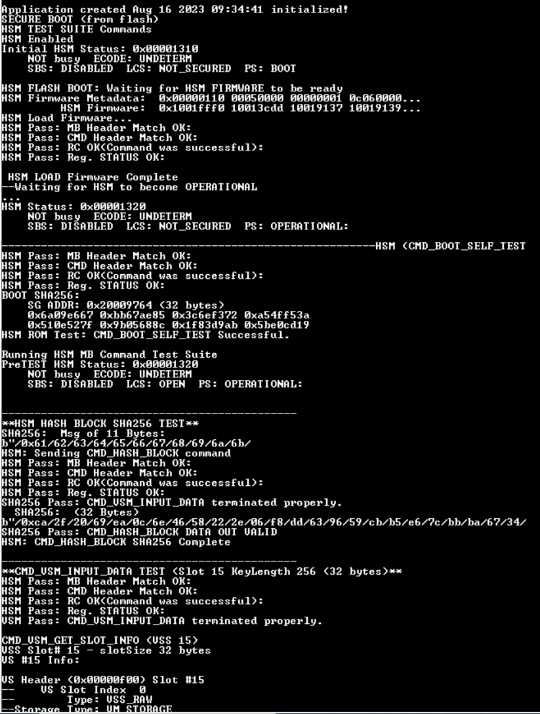
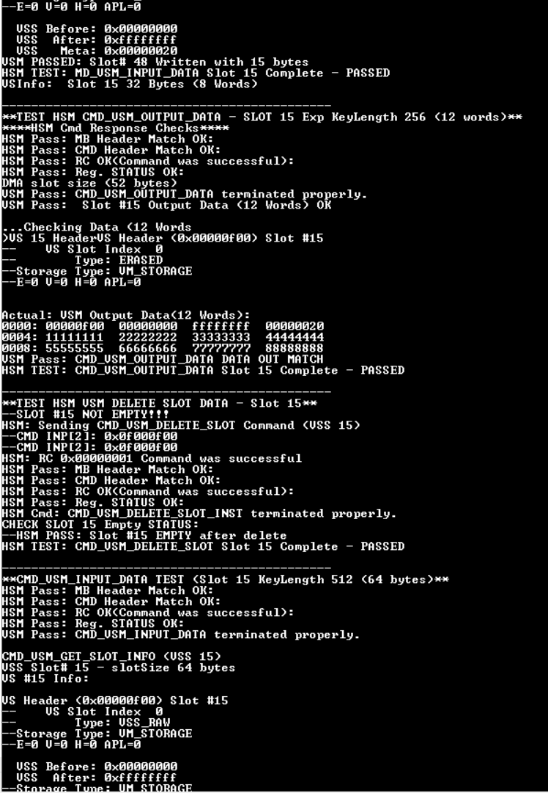

PIC32CK\_SG01\_Host_app_for\_HSM
====================================================

Introduction
------------------------
This project tests the HSM Mailbox (MB) Command API Library
as it is being developed of the PIC32CK\_SG01 MCU on the
PIC32CK\_SG01 Curiosity Ultra board.
This chip has two cores:

   1. M33 Host Core with Trust Zone
   2. M0+ Hardware Security Module (HSM) core


The HSM Command APIs are in Secure project. The NonSecure project has the Secure project as loadable.

These projects(hsm_hex.x and pic32_ck_sg01_hsm_sb->NonSecure) work together to load the M0+ HSM firmware to host flash and then the host to boot the HSM at runtime by loading the HSM firmware from flash through the Host/HSM Mailbox (MB) interface.

The host sends commands
to the M0+ through the HSM MB registers, which are
shared between the two cores.  Command results/status are
returned through the MB registers and via DMA transfers
to/from the HSM module.

TOOLS
---------------

PIC32CK_SG01 Curiosity Ultra board.
https://www.microchip.com/en-us/development-tool/ea14v17a

Recent version of MPLAB X IDE

Hardware Setup
------------------
1. Connect the Debug Com port to the PC. The board is powered by this connection.

2.  The project is programmed with the ICD 4/ICE 4
using the "Cortex Debug" connector or through the Debug Com port from the previous step.




Running the Project
-------------------

### Loading Host Flash
The HSM Firmware hex must first be loaded into the host flash memory.
This is performed using the project "hsm_hex.X". Then the host project is loaded.
1.  Open the project in MPLAB X.
2.  Add hsm_hex.X\\HSM_1M.hex to the Pre Build Files of the project.

    

3.  Program the project to load the HSM firmware image to host flash memory.  The
Host processor can then use this image to boot the HSM processor via
the HSM MB interface.

      NOTE: This has to be run when the firmware flash memory is initialized,and/or cleared, or otherwise overwritten.The host demo protects this area of flash memory. Settings for the preserve memory used in this host demo.
  

4.  Program the host project "\\pic32_ck_sg01_hsm_sb\\NonSecure\\firmware\\pic32ck\_sg01\_hsm\_sb_hostapp_NonSecure.X" to talk to hsm through mailbox. The pic32_ck_sg01_hsm_sb is group project thas has the Secure and Non-Secure projects. The Secure project is added as a loadable project to the Non-Secure Project and can be build as one project(Non-secure project),and also creates unified hex for programming.

    NOTE: Place the dowloaded project in shorter directory path to avoid build/programming errors.
### HSM Demo
The HSM Demo performs some of the basic functions of the HSM and contains
the initial development of the HSM MB Command API Library.  Each of these
implemented library functions is used to test the HSM firmware.
#### Flash Boot
When executing correctly, you should see the following output prior to the
running of the HSM Tests

If 0xFFFFFFF is reported for the Metadata or Firmware data, the HSM Firmware
flash has not been loaded, to re-program follow the steps in  Loading Host Flash section.
#### HSM Demo
A few tests of each HSM MB API Command function are executed as part
of this demo.
#### HSM Demo Implementation
The HSM MB API Library exists under folder hsm_host

##### HSM Testing Results
Results can be viewed using applications like TeraTerm. Select the COM port and set baud rate as 115200-8-N-1
NOTE:  Not all of these tests pass.
1. ##### *Hashing*
    a. Firmware Boot Self Test

    b. SHA256
with results:


```**
-------------------------------------------------**HSM (CMD_BOOT_SELF_TEST)**
HSM Pass: MB Header Match OK:
HSM Pass: CMD Header Match OK:
HSM Pass: RC OK(Command was successful):
HSM Pass: Reg. STATUS OK:
BOOT SHA256:
    SG ADDR: 0x20009764 (32 bytes)
    0x6a09e667 0xbb67ae85 0x3c6ef372 0xa54ff53a
    0x510e527f 0x9b05688c 0x1f83d9ab 0x5be0cd19
HSM ROM Test: CMD_BOOT_SELF_TEST Successful.

----------------------------------------
**HSM HASH BLOCK SHA256 TEST**
SHA256:  Msg of 11 Bytes:
b"/0x61/62/63/64/65/66/67/68/69/6a/6b/
HSM: Sending CMD_HASH_BLOCK command
HSM Pass: MB Header Match OK:
HSM Pass: CMD Header Match OK:
HSM Pass: RC OK(Command was successful):
HSM Pass: Reg. STATUS OK:
SHA256 Pass: CMD_VSM_INPUT_DATA terminated properly.
  SHA256:  (32 Bytes)
```**
b"/0xca/2f/20/69/ea/0c/6e/46/58/22/2e/06/f8/dd/63/96/59/cb/b5/e6/7c/bb/ba/67/34/bc/33/4a/37/99/bc/68/
SHA256 Pass: CMD_HASH_BLOCK DATA OUT VALID
HSM: CMD_HASH_BLOCK SHA256 Complete

---------------------------------------------
**CMD_VSM_INPUT_DATA TEST (Slot 15 KeyLength 256 (32 bytes)**
HSM Pass: MB Header Match OK:
HSM Pass: CMD Header Match OK:
HSM Pass: RC OK(Command was successful):
HSM Pass: Reg. STATUS OK:
VSM Pass: CMD_VSM_INPUT_DATA terminated properly.

CMD_VSM_GET_SLOT_INFO (VSS 15)
VSS Slot# 15 - slotSize 32 bytes
VS #15 Info:

VS Header (0x00000f00) Slot #15
--    VS Slot Index  0
--        Type: VSS_RAW
--Storage Type: VM_STORAGE
--E=0 V=0 H=0 APL=0

  VSS Before: 0x00000000
  VSS  After: 0xffffffff
  VSS   Meta: 0x00000020
VSM PASSED: Slot# 48 Written with 15 bytes
HSM TEST: MD_VSM_INPUT_DATA Slot 15 Complete - PASSED
VSInfo:  Slot 15 32 Bytes (8 Words)

---------------------------------------------
**TEST HSM CMD_VSM_OUTPUT_DATA - SLOT 15 Exp KeyLength 256 (12 words)**
****HSM Cmd Response Checks****
HSM Pass: MB Header Match OK:
HSM Pass: CMD Header Match OK:
HSM Pass: RC OK(Command was successful):
HSM Pass: Reg. STATUS OK:
DMA slot size (52 bytes)
VSM Pass: CMD_VSM_OUTPUT_DATA terminated properly.
VSM Pass:  Slot #15 Output Data (12 Words) OK

...Checking Data (12 Words
)VS 15 HeaderVS Header (0x00000f00) Slot #15
--    VS Slot Index  0
--        Type: ERASED
--Storage Type: VM_STORAGE
--E=0 V=0 H=0 APL=0


Actual: VSM Output Data(12 Words):
0000: 00000f00  00000000  ffffffff  00000020
0004: 11111111  22222222  33333333  44444444
0008: 55555555  66666666  77777777  88888888
VSM Pass: CMD_VSM_OUTPUT_DATA DATA OUT MATCH
HSM TEST: CMD_VSM_OUTPUT_DATA Slot 15 Complete - PASSED

---------------------------------------------
**TEST HSM VSM DELETE SLOT DATA - Slot 15**
--SLOT #15 NOT EMPTY!!!
HSM: Sending CMD_VSM_DELETE_SLOT Command (VSS 15)
--CMD INP[2]: 0x0f000f00
--CMD INP[2]: 0x0f000f00
HSM: RC 0x00000001 Command was successful
HSM Pass: MB Header Match OK:
HSM Pass: CMD Header Match OK:
HSM Pass: RC OK(Command was successful):
HSM Pass: Reg. STATUS OK:
HSM Cmd: CMD_VSM_DELETE_SLOT_INST terminated properly.
CHECK SLOT 15 Empty STATUS:
--HSM PASS: Slot #15 EMPTY after delete
HSM TEST: CMD_VSM_DELETE_SLOT Slot 15 Complete - PASSED

---------------------------------------------
**CMD_VSM_INPUT_DATA TEST (Slot 15 KeyLength 512 (64 bytes)**
HSM Pass: MB Header Match OK:
HSM Pass: CMD Header Match OK:
HSM Pass: RC OK(Command was successful):
HSM Pass: Reg. STATUS OK:
VSM Pass: CMD_VSM_INPUT_DATA terminated properly.

CMD_VSM_GET_SLOT_INFO (VSS 15)
VSS Slot# 15 - slotSize 64 bytes
VS #15 Info:

VS Header (0x00000f00) Slot #15
--    VS Slot Index  0
--        Type: VSS_RAW
--Storage Type: VM_STORAGE
--E=0 V=0 H=0 APL=0

  VSS Before: 0x00000000
  VSS  After: 0xffffffff
  VSS   Meta: 0x00000040
VSM PASSED: Slot# 80 Written with 15 bytes
HSM TEST: MD_VSM_INPUT_DATA Slot 15 Complete - PASSED
VSInfo:  Slot 15 64 Bytes (16 Words)

---------------------------------------------
**TEST HSM CMD_VSM_OUTPUT_DATA - SLOT 15 Exp KeyLength 512 (20 words)**
****HSM Cmd Response Checks****
HSM Pass: MB Header Match OK:
HSM Pass: CMD Header Match OK:
HSM Pass: RC OK(Command was successful):
HSM Pass: Reg. STATUS OK:
DMA slot size (84 bytes)
VSM Pass: CMD_VSM_OUTPUT_DATA terminated properly.
VSM Pass:  Slot #15 Output Data (20 Words) OK

...Checking Data (20 Words
)VS 15 HeaderVS Header (0x00000f00) Slot #15
--    VS Slot Index  0
--        Type: ERASED
--Storage Type: VM_STORAGE
--E=0 V=0 H=0 APL=0


Actual: VSM Output Data(20 Words):
0000: 00000f00  00000000  ffffffff  00000040
0004: 11111111  22222222  33333333  44444444
0008: 55555555  66666666  77777777  88888888
000c: 99999999  aaaaaaaa  bbbbbbbb  cccccccc
0010: dddddddd  eeeeeeee  ffffffff  abcdefab
VSM Pass: CMD_VSM_OUTPUT_DATA DATA OUT MATCH
HSM TEST: CMD_VSM_OUTPUT_DATA Slot 15 Complete - PASSED

---------------------------------------------
**TEST HSM VSM DELETE SLOT DATA - Slot 15**
--SLOT #15 NOT EMPTY!!!
HSM: Sending CMD_VSM_DELETE_SLOT Command (VSS 15)
--CMD INP[2]: 0x0f000f00
--CMD INP[2]: 0x0f000f00
HSM: RC 0x00000001 Command was successful
HSM Pass: MB Header Match OK:
HSM Pass: CMD Header Match OK:
HSM Pass: RC OK(Command was successful):
HSM Pass: Reg. STATUS OK:
HSM Cmd: CMD_VSM_DELETE_SLOT_INST terminated properly.
CHECK SLOT 15 Empty STATUS:
--HSM PASS: Slot #15 EMPTY after delete
HSM TEST: CMD_VSM_DELETE_SLOT Slot 15 Complete - PASSED
VSS AES ECB Test- Using Streaming Key (-1)

---------------------------------------------

**HSM AES256 ECB Encryption/Decryption TEST (Slot -1)**
Key (16 Bytes):
b"/0x61/62/63/64/65/66/67/68/69/6a/6b/6c/6d/6e/6f/70/
Msg (32 Bytes):
TechTutorialsX!!TechTutorialsX!!
b"/0x54/65/63/68/54/75/74/6f/72/69/61/6c/73/58/21/21/54/65/63/68/54/75/74/6f/72/69/61/6c/73/58/21/21/
HSM: Sending CMD_AES_ENCRYPT command (msg L=8 words
HSM Pass: MB Header Match OK:
HSM Pass: CMD Header Match OK:
HSM Pass: RC OK(Command was successful):
HSM Pass: Reg. STATUS OK:
AES256 Pass: CMD_VSM_INPUT_DATA terminated properly.
AES256:  Encrypted MSG (8 Words)
b"/0x11/d0/4b/87/76/94/92/04/df/bf/7f/5a/3c/7b/1c/40/11/d0/4b/87/76/94/92/04/df/bf/7f/5a/3c/7b/1c/40/
AES 256 FAIL: !!!CMD_AES Encryption ERROR !!!
Expected: Encrypted MSG (8 Words)
b"/0x17/5a/a7/ea/1d/ec/81/b6/8d/6f/1c/d3/03/16/e7/e6/17/5a/a7/ea/1d/ec/81/b6/8d/6f/1c/d3/03/16/e7/e6/
HSM: CMD_AES_256 Encrypt/Decrypt Complete

---------------------------------------------

**HSM AES128 ECB Encryption/Decryption TEST G1 T2 (Slot -1)**
Key (16 Bytes):
b"/0x00/00/00/00/00/00/00/00/00/00/00/00/00/00/00/00/
Msg (16 Bytes):
b"/0xf3/44/81/ec/3c/c6/27/ba/cd/5d/c3/fb/08/f2/73/e6/
HSM: Sending CMD_AES_ENCRYPT (G1T2) command (msgLength=4 words
HSM Pass: MB Header Match OK:
HSM Pass: CMD Header Match OK:
HSM Pass: RC OK(Command was successful):
HSM Pass: Reg. STATUS OK:
AESG1T2 Pass: CMD_VSM_INPUT_DATA terminated properly.
AESG1T2:  Encrypted MSG (4 Words)
b"/0x67/9f/80/20/e5/db/96/e4/78/c6/e5/23/9d/db/d9/09/
AES G1T2 FAIL: !!!CMD_AES Encryption ERROR !!!
Expected: Encrypted MSG (4 Words)
b"/0x03/36/76/3e/96/6d/92/59/5a/56/7c/c9/ce/53/7f/5e/
HSM: CMD_AES_Encrypt G1T2 Complete

PostTEST HSM Status: 0x00001320
    NOT busy  ECODE: UNDETERM
    SBS: DISABLED  LCS: NOT_SECURED  PS: OPERATIONAL:

**** COMPLETED HSM MB TEST Suite ********


```






